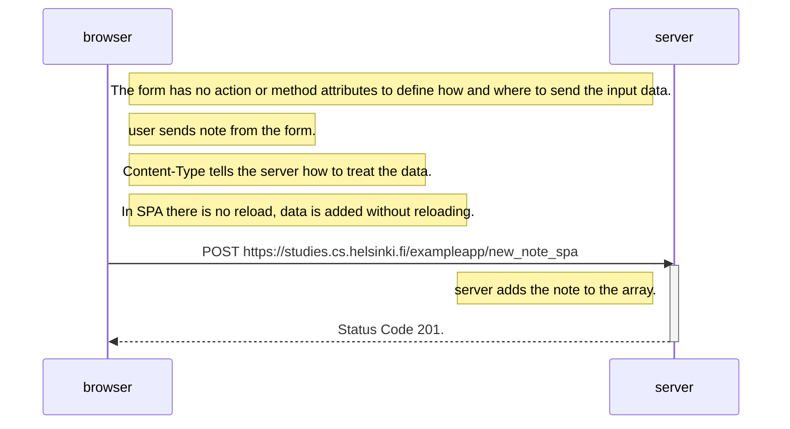

```mermaid
sequenceDiagram
    participant browser
    participant server

    Note right of browser: The form has no action or method attributes to define how and where to send the input data.
    Note right of browser: user sends note from the form.
    Note right of browser: Content-Type tells the server how to treat the data.
    Note right of browser: In SPA there is no reload, data is added without reloading.

    browser->>server: POST https://studies.cs.helsinki.fi/exampleapp/new_note_spa
    activate server

    Note left of server: server adds the note to the array.
    server-->>browser: Status Code 201.
    deactivate server


```
